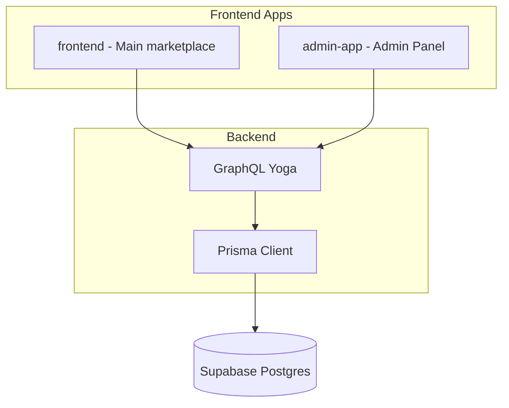

# Admin Panel (User Management for Astrology Students and Astrologers)

## Architecture overview



- **frontend**: Main marketplace app (existing). No change to scope in this plan.
- **admin-app**: Admin Panel. Only **admin** and **superadmin** roles can log in. Contains the **User Management Dashboard**, which is exclusively for managing users with roles **astrology_student** and **astrologer** (list, view detail, edit profile, reset password, view Kundli and chats). Superadmin users are never listed, viewable, or editable in the Admin Panel UI or API.
- **backend**: Shared. New GraphQL queries/mutations for admin operations; all enforce admin/superadmin role and exclude superadmin from results and targets.

---

## Part 1: Backend schema and API

### 1.1 Prisma schema changes

**File:** [backend/prisma/schema.prisma](backend/prisma/schema.prisma)

- Add `d7` to Kundli (optional Json, like d1/d9/d10) for D7 chart support.
- No changes to Chat/Message for now; existing user-LLM chats are sufficient for User Detail.

### 1.2 New GraphQL types and operations (admin-only)

**File:** [backend/src/graphql/schema.ts](backend/src/graphql/schema.ts)

**New types:**

- `AdminUser` (id, username, email, role, is_active, kundli_added, created_at) — only for astrology_student and astrologer; no password or PII in list view.
- `AdminUserDetail` — full profile for User Detail (include date_of_birth, place_of_birth, time_of_birth for admin edit).
- `UserListResult`, `UserDetailResult`, `UpdateUserResult`, `ResetPasswordResult`.

**New queries (require admin or superadmin; only return astrology_student and astrologer users):**

- `adminListUsers(role?: String, search?: String): UserListResult` — list users for the User Management Dashboard. **Only include users with role `astrology_student` or `astrologer`.** Filter by role (within those two), search by username/email. Never include superadmin or admin.
- `adminGetUser(id: ID!): UserDetailResult` — get user by id for User Detail. Return 404 if user is not astrology_student or astrologer (or not found).

**New mutations (require admin or superadmin; only allow updating astrology_student or astrologer):**

- `adminUpdateUser(id: ID!, input: AdminUpdateUserInput!): UpdateUserResult` — update profile fields. Reject if target user is not astrology_student or astrologer.
- `adminResetPassword(id: ID!, newPassword: String!): ResetPasswordResult` — reset password. Reject if target user is not astrology_student or astrologer.

**RBAC:** Use `requireRoles(context, ['admin', 'superadmin'])` for all admin operations. Every admin operation that accepts a user id must verify the target user's role is one of `astrology_student`, `astrologer`; otherwise return 404/error.

### 1.3 Query for User Detail: Kundli and Chats

**Existing queries to reuse or extend:**

- `chatMessages(chatId)` — already returns messages for a chat. Admin needs to fetch chats for a given user.
- Add `adminGetUserChats(userId: ID!): ChatsResult` — returns chats for userId. Require admin/superadmin. Verify userId is not superadmin.

**Kundli:** Add `adminGetUserKundli(userId: ID!): KundliResult` — returns latest kundli (biodata, d1, d7, d9, d10, etc.) for admin view. Require admin/superadmin.

### 1.4 REST endpoints (optional, for admin panel)

**File:** [backend/server.ts](backend/server.ts)

- `POST /api/admin/login` — same as GraphQL login; returns JWT. Frontend can use GraphQL login instead.
- `GET /api/admin/users` — list users (JWT required, admin/superadmin). Wraps adminListUsers.
- `GET /api/admin/users/:id` — user detail. Wraps adminGetUser.
- `PATCH /api/admin/users/:id` — update user. Wraps adminUpdateUser.
- `POST /api/admin/users/:id/reset-password` — reset password. Wraps adminResetPassword.

Prefer GraphQL for admin-app; add REST only if you want a mixed approach. Plan assumes GraphQL-first.

### 1.5 CORS

Add admin-app origin (e.g. `http://localhost:5174`) to CORS in [backend/server.ts](backend/server.ts).

---

## Part 2: Admin Panel app (admin-app/)

### 2.1 Setup

- Create `admin-app/` with Vite + React + TypeScript (same stack as frontend).
- Dependencies: react, react-router-dom, tailwindcss, a simple table/grid library (e.g. TanStack Table or plain table), tab component (e.g. Radix Tabs or custom).
- Env: `VITE_GRAPHQL_ENDPOINT`, `VITE_API_BASE` (backend URL).

### 2.2 Routes and layout

- `/` — redirect to `/login` if not authenticated, else `/dashboard`.
- `/login` — Admin login page. Only admin and superadmin can proceed; others see "Access denied."
- `/dashboard` — **User Management Dashboard**: list only astrology_student and astrologer users. Table: username, email, role, is_active, kundli_added, actions (View). Filter by role (astrology_student | astrologer), search. Never show admin or superadmin.
- `/users/:id` — User Detail page. Tabs: Profile, Kundli, Chats. Only valid for users who are astrology_student or astrologer (backend returns 404 otherwise).

### 2.3 Login page

- Username + password form.
- Call GraphQL `login` mutation.
- If success and `role` in ['admin','superadmin'], store JWT and userId, redirect to `/dashboard`.
- If success but role not admin/superadmin, show "Access denied. Admin only."
- Logout clears token and redirects to `/login`.

### 2.4 User list (User Management Dashboard)

- Table: username, email, role (astrology_student | astrologer only), is_active, kundli_added, created_at, Actions (View).
- Filters: role dropdown (astrology_student, astrologer), search input.
- "View" opens `/users/:id`.
- Use `adminListUsers` query; backend returns only astrology_student and astrologer. Pagination optional (cursor or offset).

### 2.5 User Detail page

**Layout:** Tab panel.

**Tab 1 – Profile**

- Display: username, email, role, date_of_birth, place_of_birth, time_of_birth, gender, is_active.
- Edit form (admin only): update fields via `adminUpdateUser`.
- "Reset password" button: modal with new password, call `adminResetPassword`.

**Tab 2 – Kundli**

- Fetch `adminGetUserKundli(userId)`.
- Sections/cards: Biodata, D1, D7, D9, D10, Chara Karaka, Vimsottari Dasa, Other readings.
- Display JSON in readable format (e.g. formatted JSON or key-value list).

**Tab 3 – Chats**

- Fetch `adminGetUserChats(userId)` then `chatMessages(chatId)` for each chat.
- Group by chat, show messages (question, ai_answer, created_at) in chronological order.
- Optional: group by date.

### 2.6 Auth guard

- Route guard: if no valid JWT or role not admin/superadmin, redirect to `/login`.
- Parse JWT or call `me` query to get role; cache in context/state.

---

## Part 3: Security (admin-app and backend)

Security must be maintained end-to-end for the Admin Panel.

### 3.1 Backend

- **Auth:** All admin operations require JWT and `requireRoles(context, ['admin', 'superadmin'])`. No admin operation is callable by other roles.
- **Target users:** Every admin query/mutation that takes a user id must load the user, check `role` is one of `astrology_student`, `astrologer`, and return 404 or error otherwise. Never return or update admin or superadmin via admin API.
- **Tokens:** Store only opaque JWT in admin-app; do not store role in localStorage without verifying via `me` on critical navigation if desired.
- **CORS:** Restrict admin-app origin in production; do not use wildcard for admin endpoint.
- **Input validation:** Validate `AdminUpdateUserInput` and `newPassword` (e.g. length, format) in resolvers or adminService.

### 3.2 Admin-app (frontend)

- **Login:** After `login` mutation, enforce role on client: if `role` not in `['admin','superadmin']`, do not store token, show "Access denied" and do not redirect to dashboard.
- **Route guard:** On every protected route, ensure JWT is present and (optionally) role from `me` is admin or superadmin; else redirect to `/login`.
- **API:** Send `Authorization: Bearer <token>` for all GraphQL requests; backend rejects unauthenticated or wrong-role requests.
- **No superadmin in UI:** User list and User Detail are backed by APIs that return only astrology_student/astrologer; no need to display admin/superadmin.

---

## Part 4: Backend implementation details

### 4.1 Admin service

**File:** `backend/src/services/adminService.ts`

- `listUsers(prisma, role?, search?)` — prisma.auth.findMany with where: role in ['astrology_student','astrologer'], optional role filter within that set, optional search on username/email.
- `getUserById(prisma, id)` — findUnique; return null if user is not astrology_student or astrologer.
- `updateUser(prisma, id, input)` — reject if target user is not astrology_student or astrologer; update allowed fields.
- `resetPassword(prisma, id, newPassword)` — reject if target user is not astrology_student or astrologer; hash and update password.

### 4.2 Schema extension for admin queries

- `adminGetUserChats`: prisma.chat.findMany({ where: { user_id: userId } }) — ensure userId belongs to an astrology_student or astrologer.
- `adminGetUserKundli`: prisma.kundli.findFirst({ where: { user_id: userId }, orderBy: { created_at: 'desc' } }) — ensure userId belongs to an astrology_student or astrologer.

---

## Part 5: Testing

Unit tests are required from the start for both admin-app UI and new backend functionality.

### 5.1 Admin-app (UI) unit tests

- **Setup:** Vitest + React Testing Library + jsdom (same as main frontend). Config in `admin-app/vite.config.ts`, `admin-app/src/test/setup.ts`, and test script in `package.json`.
- **Per page:** At least one test file per page (e.g. `AdminLogin.test.tsx`, `Dashboard.test.tsx`, `UserDetail.test.tsx`) covering: render, key interactions (login submit, filter, view user), and error/empty states where relevant.
- **Per component:** Unit tests for shared components (e.g. table, tabs, profile form, reset-password modal) covering props, user interactions, and callbacks.
- **Auth:** Tests for login success (admin/superadmin), login rejection (non-admin role), and route guard redirect when unauthenticated or wrong role.
- **Mocks:** Mock GraphQL client or fetch so tests do not call the real backend.

### 5.2 Backend unit tests

- **Admin service:** `backend/tests/unit/adminService.test.ts` — mock Prisma; test `listUsers` (filters by role, excludes non-astrology roles), `getUserById` (returns null for admin/superadmin), `updateUser` and `resetPassword` (reject when target is not astrology_student/astrologer).
- **Admin resolvers:** `backend/tests/unit/adminResolvers.test.ts` (or equivalent) — mock context (admin/superadmin) and Prisma; test that adminListUsers, adminGetUser, adminUpdateUser, adminResetPassword enforce role and target-user role; test 404/error when target is admin/superadmin.
- **RBAC:** Reuse or extend existing rbac tests to ensure admin operations use `requireRoles(context, ['admin', 'superadmin'])`.

---

## Part 6: Enterprise dashboard patterns (admin-app)

- **Layout:** Sidebar (nav) + top bar (user, logout) + main content.
- **Tables:** Sortable columns, filters, loading states.
- **Forms:** Validation, error messages, success feedback.
- **Tabs:** Accessible tab panel for User Detail.
- **Modals:** Reset password confirmation.
- **Responsive:** Basic mobile-friendly layout.

---

## Part 7: File and folder structure

```
AdAstra/
├── admin-app/                 # New
│   ├── src/
│   │   ├── main.tsx
│   │   ├── App.tsx
│   │   ├── routes.tsx
│   │   ├── lib/graphql.ts
│   │   ├── test/setup.ts
│   │   ├── Auth/
│   │   │   ├── AdminLogin.tsx
│   │   │   ├── AdminLogin.test.tsx
│   │   │   └── AdminAuthProvider.tsx
│   │   ├── pages/
│   │   │   ├── Dashboard.tsx
│   │   │   ├── Dashboard.test.tsx
│   │   │   ├── UserDetail.tsx
│   │   │   └── UserDetail.test.tsx
│   │   └── components/         # with corresponding .test.tsx per component
│   ├── package.json
│   └── vite.config.ts
├── backend/                   # Extend
│   ├── prisma/schema.prisma   # Add d7 to Kundli
│   └── src/
│       ├── graphql/schema.ts  # Admin queries/mutations
│       ├── services/adminService.ts
│       └── server.ts          # CORS
│   └── tests/
│       └── unit/
│           ├── adminService.test.ts
│           └── adminResolvers.test.ts  # or equivalent
└── frontend/                  # Main marketplace (unchanged for this phase)
```

---

## Part 8: Implementation order

1. **Backend:** Prisma migration (add d7), adminService with role checks, GraphQL admin operations, CORS. Add backend unit tests for adminService and admin resolvers.
2. **admin-app:** Scaffold with Vitest + RTL and test setup from the start; login page + tests; User Management Dashboard (user list) + tests; User Detail (tabs: Profile, Kundli, Chats) + tests; shared components + tests.

---

## Out of scope (later phases)

- Astrologer-student and astrologer-LLM conversation types.
- GraphQL codegen.
- REST endpoints if GraphQL is sufficient.

