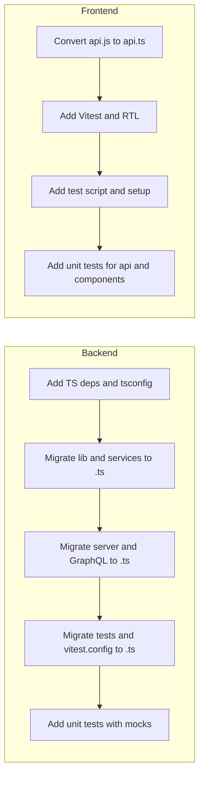
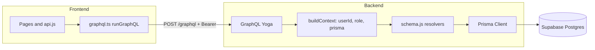

# Backend TypeScript + Unit Tests / Frontend TypeScript Completion + Unit Tests

## Recommended upgrade (enterprise web platform marketplace)

What will be done as the **recommended upgrade** for the enterprise marketplace:

**1. Backend: TypeScript and tests**

- Add TypeScript (tsconfig, types, build or tsx) and migrate all backend source and tests from `.js` to `.ts`.
- Keep Vitest; migrate test files and config to TypeScript; add **unit** tests with Prisma mocked so CI can run without a DB for fast feedback.
- Result: typed API layer, safer refactors, and a test suite that supports CI and regression coverage.

**2. Frontend: TypeScript completion and tests**

- Convert the last remaining JS file ([frontend/src/Auth/api.js](frontend/src/Auth/api.js)) to TypeScript and add Vitest + React Testing Library with a test script and setup.
- Add unit tests for auth API (login/signup with mocked GraphQL) and selected components.
- Result: 100% TypeScript on the frontend and a baseline of automated tests for critical paths.

**3. RBAC: roles and enforcement**

- Introduce and enforce the six marketplace roles: **superadmin**, **admin**, **astrologer**, **astrology_student**, **support**, **user** (stored in `auth.role` and JWT).
- Add `requireAuth(context)` and `requireRoles(context, allowedRoles)` in GraphQL resolvers; for all current authenticated operations use the full allowlist so every valid role can use the existing API; reserve stricter checks for future admin/support/astrologer-only operations.
- Result: explicit, auditable role-based access ready for admin panels, support tools, and astrologer features.

**4. Security and API hygiene**

- **REST:** Remove or strictly protect legacy endpoints: require JWT (and same user) for POST `/query`; disable or protect GET `/debug/kundli/:user_id` in production.
- **Supabase (optional):** Define RLS policies that mirror resolver rules for defense-in-depth; Prisma remains the primary enforcement layer.

**5. Optional follow-ups (not in scope of this upgrade)**

- GraphQL codegen for schema/type sync between frontend and backend.
- New operations with role restrictions: e.g. `listUsers` / `getUser` (admin, superadmin, support), update user role (admin, superadmin), manage system prompts (superadmin), astrologer “create reading for client” (astrologer).

---

## Current state

| Area         | Language              | Tests                        | Notes                                                                                                                |
| ------------ | --------------------- | ---------------------------- | -------------------------------------------------------------------------------------------------------------------- |
| **Backend**  | 100% JavaScript (ESM) | Vitest; 2 test files + setup | No TypeScript, no tsconfig                                                                                           |
| **Frontend** | ~99% TypeScript       | None                         | One file still JS: [frontend/src/Auth/api.js](frontend/src/Auth/api.js); tsconfig and Vite TS build already in place |

---

## Part 1: Backend → TypeScript and unit tests

### 1.1 What’s already done

- **Tests:** Vitest is configured ([backend/vitest.config.js](backend/vitest.config.js)) with `tests/setup.js`, `tests/auth-flow.test.js`, and `tests/db-connection.test.js`; `npm test` runs them.
- **Prisma:** Typed client from `prisma generate`; usable from TS with no extra setup once the backend is TS.

### 1.2 What’s needed

**TypeScript setup**

- Add `typescript`, `@types/node`, and (as needed) `@types/express`, `@types/jsonwebtoken`, etc. to [backend/package.json](backend/package.json).
- Add [backend/tsconfig.json](backend/tsconfig.json): `"module": "NodeNext"`, `"moduleResolution": "NodeNext"`, `"outDir": "dist"`, `"rootDir": "."`, include `server.js` and `src/`** (then switch to `*.ts` after migration). Exclude `node_modules`, `dist`, and optionally `tests` if you keep them in JS initially.
- Decide run strategy:
  - **A) Compile then run:** `tsc` → `node dist/server.js` (and run tests from `dist` or from TS — see below).
  - **B) No emit (type-check only) + run with tsx:** Keep running `node server.js` during migration by renaming to `.ts` and using `tsx server.ts` (or `ts-node`) so you can migrate incrementally. Later add `tsc --noEmit` and optionally a build that emits to `dist`.

**Source migration (order suggested)**

- **Libraries first (no app deps):** [backend/src/lib/hash.js](backend/src/lib/hash.js), [backend/src/lib/validators.js](backend/src/lib/validators.js), [backend/src/lib/encrypt.js](backend/src/lib/encrypt.js), [backend/src/lib/dbCheck.js](backend/src/lib/dbCheck.js), [backend/src/lib/prisma.js](backend/src/lib/prisma.js), [backend/src/lib/llmClient.js](backend/src/lib/llmClient.js).
- **Services:** [backend/src/services/authService.js](backend/src/services/authService.js), [backend/src/services/kundliService.js](backend/src/services/kundliService.js).
- **GraphQL and server:** [backend/src/graphql/context.js](backend/src/graphql/context.js), [backend/src/graphql/schema.js](backend/src/graphql/schema.js), [backend/src/ensureSuperadmin.js](backend/src/ensureSuperadmin.js), [backend/server.js](backend/server.js), [backend/kundli-rag.js](backend/kundli-rag.js), [backend/supa/chatController.js](backend/supa/chatController.js).
- **Config:** Rename [backend/vitest.config.js](backend/vitest.config.js) to `vitest.config.ts` and point `include` at `tests/**/*.test.ts` once tests are migrated.
- **Tests:** [backend/tests/setup.js](backend/tests/setup.js), [backend/tests/db-connection.test.js](backend/tests/db-connection.test.js), [backend/tests/auth-flow.test.js](backend/tests/auth-flow.test.js) → `.ts`. Vitest runs TypeScript natively with the project’s tsconfig.

**Unit test strategy**

- Keep existing tests as integration-style (DB and auth flow). Add **unit** tests by mocking Prisma (e.g. `vi.mock('../src/lib/prisma.js')`) and testing resolvers, `authService`, `validators`, and pure helpers (hash, encrypt) in isolation so `npm test` doesn’t require a real DB for those.
- Optional: add `vitest.config.ts` `coverage` and a `test:unit` script that excludes DB-dependent tests when `DATABASE_URL` is unset (already partially done via `hasDb` in auth-flow tests).

**Package.json scripts (example)**

- `"build": "tsc"`, `"start": "node dist/server.js"` (if using emit), or keep `"start": "tsx server.ts"` and add `"typecheck": "tsc --noEmit"`.
- `"test": "vitest run"` (unchanged; Vitest will pick up `.ts` once config and tests are migrated).

---

## Part 2: Frontend → TypeScript completion + unit tests

### 2.1 What’s already done

- **TypeScript:** App code is almost entirely `.ts`/`.tsx`. [frontend/tsconfig.json](frontend/tsconfig.json) and [frontend/tsconfig.app.json](frontend/tsconfig.app.json) are set up with strict mode; [frontend/vite.config.ts](frontend/vite.config.ts) uses `@vitejs/plugin-react`; `typescript`, `@types/react`, `@types/react-dom` are in devDependencies.
- **Gap:** Single remaining JS file: [frontend/src/Auth/api.js](frontend/src/Auth/api.js) (login/signup GraphQL wrappers).

### 2.2 What’s needed

**Finish TypeScript**

- Convert [frontend/src/Auth/api.js](frontend/src/Auth/api.js) to `api.ts`: add types for `login`, `signup` args and return values (and any shared types from [frontend/src/lib/graphql.ts](frontend/src/lib/graphql.ts) if needed). Delete `api.js` and update imports (e.g. in [frontend/src/pages/SignIn.tsx](frontend/src/pages/SignIn.tsx), SignUp, AuthProvider).

**Unit test setup**

- Add **Vitest** and **React Testing Library** (and **jsdom**): e.g. `vitest`, `@testing-library/react`, `@testing-library/jest-dom`, `jsdom` as devDependencies.
- In [frontend/vite.config.ts](frontend/vite.config.ts): add Vitest’s `test` block: `environment: 'jsdom'`, `globals: true`, `setupFiles` pointing to a small setup file that imports `@testing-library/jest-dom`.
- Add `"test": "vitest"` and `"test:run": "vitest run"` to [frontend/package.json](frontend/package.json).
- Optional: create `src/test/setup.ts` (or `setupTests.ts`) that imports `@testing-library/jest-dom`.

**Initial unit tests**

- **API / GraphQL layer:** Unit tests for `login`/`signup` in `api.ts` by mocking `runGraphQL` (and optionally `setAuth`) so no real backend is required.
- **Utilities:** If [frontend/src/lib/kundliParser.ts](frontend/src/lib/kundliParser.ts) or [frontend/src/lib/graphql.ts](frontend/src/lib/graphql.ts) have pure logic, add tests for those.
- **Components:** A few shallow or focused tests for critical UI (e.g. SignIn form submission, or a presentational component) using RTL `render`, `screen`, `userEvent` to avoid regressions.

No change to the frontend build or TypeScript config is required beyond the new test setup and the one file conversion.

---

## Suggested order of work

- **Backend:** TS setup → migrate source files → migrate tests and config → add unit tests (with Prisma mocks).
- **Frontend:** Convert `api.js` → `api.ts` → add Vitest + RTL + script and setup → add unit tests for auth API and selected components.

---

## Risks / notes

- **Backend:** GraphQL schema and resolvers use dynamic types; you may need explicit interfaces for context and resolver args/return types. Prisma types will flow through once `prisma.ts` is typed.
- **Frontend:** `api.js` is small; conversion is low risk. Mocking `runGraphQL` in tests keeps them fast and offline.
- **CI:** Ensure backend tests run with a real DB only when `DATABASE_URL` is set; unit tests should skip or mock DB so CI can run without Supabase.

---

## Part 3: GraphQL, RBAC, and schema gaps review

### 3.1 GraphQL usage (where it’s used)

| Layer        | How GraphQL is used                                                                                                                                                                                                                                                                                                                                                                                                                                                                                                                                                                                             |
| ------------ | --------------------------------------------------------------------------------------------------------------------------------------------------------------------------------------------------------------------------------------------------------------------------------------------------------------------------------------------------------------------------------------------------------------------------------------------------------------------------------------------------------------------------------------------------------------------------------------------------------------- |
| **Frontend** | Single client in [frontend/src/lib/graphql.ts](frontend/src/lib/graphql.ts): `runGraphQL(operation, variables)` with optional `Authorization: Bearer <token>`. Used by [frontend/src/Auth/api.js](frontend/src/Auth/api.js) (login, signup), [frontend/src/pages/UserData.ts](frontend/src/pages/UserData.ts) (meDetails, myBiodata, ask, myContent), and [frontend/src/pages/chat-interface/chatAPI.ts](frontend/src/pages/chat-interface/chatAPI.ts) (chats, createChat, setChatInactive, activeChat, addMessage, chatMessages). No Supabase or internal API URLs; one endpoint from `VITE_GRAPHQL_ENDPOINT`. |
| **Backend**  | [backend/server.js](backend/server.js) mounts GraphQL Yoga at the default path (e.g. `/graphql`) with `context: buildContext`. Schema and resolvers live in [backend/src/graphql/schema.js](backend/src/graphql/schema.js). All data access goes through **Prisma** (context provides `prisma`); no Supabase JS client.                                                                                                                                                                                                                                                                                         |
| **Prisma**   | Sole DB layer. [backend/prisma/schema.prisma](backend/prisma/schema.prisma) defines Auth, Kundli, SystemPrompt, UserGeneratedContent, Chat, Message. Resolvers use `context.prisma` for every query/mutation.                                                                                                                                                                                                                                                                                                                                                                                                   |

### 3.2 RBAC on GraphQL and REST

**Context:** [backend/src/graphql/context.js](backend/src/graphql/context.js) builds `{ userId, role, prisma, request }`. JWT is verified; `userId` and `role` (e.g. `user`, `superadmin`) come from the token. **Role is never used for authorization.**

**GraphQL**

- **Public (no auth):** `login`, `signup` — correct.
- **Authenticated only:** All other queries and mutations check only `if (!userId)` and return “Not authenticated” or `null`. There is **no** check like `role === 'superadmin'` or “admin-only” for any operation. So any logged-in user can call `me`, `meDetails`, `myBiodata`, `myContent`, `ask`, `chats`, `activeChat`, `chatMessages`, `uploadKundli`, `createChat`, `setChatInactive`, `addMessage`. Row-level security is enforced by **resolver logic** (e.g. `where: { user_id: userId }`), not by role.
- **Gap:** If you intend superadmin-only operations (e.g. list all users, manage system prompts), they do not exist yet and would need explicit role checks in resolvers (or middleware).

**REST (legacy)**

- **POST `/query`** — Body: `{ question, userID }`. Validates that `userID` exists in `auth` table; **no JWT**. So any client that knows a user id can call this; auth is weaker than GraphQL.
- **GET `/debug/kundli/:user_id`** — Returns latest kundli and chunks for the given `user_id`. **No auth.** Anyone can read any user’s kundli data. Should be disabled or protected in production (as noted in [backend/CODE_REVIEW_AND_SUMMARY.md](backend/CODE_REVIEW_AND_SUMMARY.md)).

**Summary:** GraphQL uses JWT and scopes data by `userId` in resolvers; no role-based rules. REST has auth gaps (no JWT on `/query`, no auth on `/debug`).

### 3.3 Gaps: GraphQL vs Prisma vs Supabase DB schema

| Aspect                      | Detail                                                                                                                                                                                                                                                                                                                                                                                                                                                                           |
| --------------------------- | -------------------------------------------------------------------------------------------------------------------------------------------------------------------------------------------------------------------------------------------------------------------------------------------------------------------------------------------------------------------------------------------------------------------------------------------------------------------------------- |
| **Schema source of truth**  | **Prisma** ([backend/prisma/schema.prisma](backend/prisma/schema.prisma)) is the source. Migrations (`prisma migrate` / `db push`) apply to the database. Supabase is the Postgres host; there is no separate “Supabase schema” — the app does not use Supabase Auth or Realtime, only custom `auth` table and JWT.                                                                                                                                                              |
| **Supabase SQL migrations** | [backend/supabase/migrations/](backend/supabase/migrations/) contain: (1) `20250220000000_add_auth_role.sql` — adds `role` to `auth` (already in Prisma); (2) `20250224000000_rls_policies.sql` — enables RLS on auth, kundlis, system_prompts, user_generated_content, chats, messages but **no policies are defined**. With Prisma using a single DB user (typically service/owner), RLS may be bypassed; policies would matter if you ever use a restricted role (e.g. anon). |
| **GraphQL vs Prisma**       | GraphQL types (User, UserDetails, BiodataResult, etc.) are **hand-written** in [backend/src/graphql/schema.js](backend/src/graphql/schema.js). Resolvers map to Prisma models and explicitly select fields (e.g. no `password`, `date_of_birth` in `me`). **Gaps:** (1) No schema/codegen — frontend and backend types can drift from the GraphQL schema. (2) New Prisma fields or models require manual GraphQL type and resolver updates.                                      |
| **Sensitive data**          | Prisma models include `Auth.password`, `Auth.date_of_birth`, etc.; GraphQL correctly omits these from `User` and other types. Resolvers use `select` to limit columns. No accidental exposure identified.                                                                                                                                                                                                                                                                        |
| **Ownership checks**        | Chat and message resolvers correctly restrict by `user_id` (e.g. `where: { id: chatId, user_id: userId }`). Kundli and content are scoped to `userId`. No cross-user data leak in the current resolver logic.                                                                                                                                                                                                                                                                    |

### 3.4 Default roles (public-facing marketplace platform)

Standard roles to implement and store in `auth.role` (e.g. in [backend/prisma/schema.prisma](backend/prisma/schema.prisma) and JWT):

| Role                  | Purpose                                                                                                                                                                                     |
| --------------------- | ------------------------------------------------------------------------------------------------------------------------------------------------------------------------------------------- |
| **superadmin**        | Full platform control: config, system prompts, user/role management, and any future admin-only operations. Single or few accounts; created via `ensureSuperadmin` or seed.                  |
| **admin**             | Platform management: manage users (e.g. list, disable, assign roles), support escalations, content moderation. No superadmin-only config (e.g. JWT secret, system prompts).                 |
| **astrologer**        | Professional astrologer: full user capabilities plus (future) client/reading features — e.g. linked clients, create readings for clients. For now, same as `user` for existing API.         |
| **astrology_student** | Learning role: same as `user` for existing API; future: optionally limited RAG or read-only access to sample charts.                                                                        |
| **support**           | Customer support: help users (e.g. view user profile/kundli in a support context with audit). Future: impersonate or “view as user” with logging. For now, same as `user` for existing API. |
| **user**              | Default for signup. Standard marketplace user: own profile, kundli, chat, RAG ask, content.                                                                                                 |

Role hierarchy (for future use): `superadmin` > `admin` > `astrologer` | `support` | `astrology_student` | `user`. Comparison should be explicit (e.g. allowlist per operation), not ordinal.

---

### 3.5 Mutation and query access by role

**Public (no JWT):**

- **login** — Allowed: unauthenticated. Returns token and role.
- **signup** — Allowed: unauthenticated. Creates account with role `user` (or allow `astrology_student` self-signup later).

**Authenticated (any valid role):**

Current resolvers only check `userId`; they do not restrict by role. So today every authenticated role can run the same operations. Below is the intended **allowed roles** per operation; implementation will require adding a role check (e.g. `requireRoles(context, ['user', 'astrologer', ...])`) at the start of each resolver.

**Mutations**

| Mutation            | Allowed roles                                                   | Notes                                                                                              |
| ------------------- | --------------------------------------------------------------- | -------------------------------------------------------------------------------------------------- |
| **login**           | (public)                                                        | No auth.                                                                                           |
| **signup**          | (public)                                                        | Default role `user`; optionally allow `astrology_student` via input.                               |
| **uploadKundli**    | user, astrology_student, astrologer, support, admin, superadmin | Own kundli only (resolver already scopes by `userId`). Support/admin may need for testing or help. |
| **createChat**      | user, astrology_student, astrologer, support, admin, superadmin | Own chat.                                                                                          |
| **setChatInactive** | user, astrology_student, astrologer, support, admin, superadmin | Own chat only.                                                                                     |
| **addMessage**      | user, astrology_student, astrologer, support, admin, superadmin | Own chat only.                                                                                     |

**Queries**

| Query            | Allowed roles                                                   | Notes                       |
| ---------------- | --------------------------------------------------------------- | --------------------------- |
| **me**           | user, astrology_student, astrologer, support, admin, superadmin | Own profile.                |
| **meDetails**    | user, astrology_student, astrologer, support, admin, superadmin | Own details.                |
| **myBiodata**    | user, astrology_student, astrologer, support, admin, superadmin | Own kundli biodata.         |
| **myContent**    | user, astrology_student, astrologer, support, admin, superadmin | Own generated content.      |
| **ask**          | user, astrology_student, astrologer, support, admin, superadmin | RAG Q&A for own kundli.     |
| **chats**        | user, astrology_student, astrologer, support, admin, superadmin | Own chats.                  |
| **activeChat**   | user, astrology_student, astrologer, support, admin, superadmin | Own active chat.            |
| **chatMessages** | user, astrology_student, astrologer, support, admin, superadmin | Messages for own chat only. |

**Conclusion from review:** For the **current** schema, every mutation and query (except login/signup) is “any authenticated role” and data is already scoped by `userId`. So one implementation approach is:

- Add a helper, e.g. `requireAuth(context)` that throws if `!context.userId`, and optionally `requireRoles(context, allowedRoles)` that throws if `context.role` is not in the list.
- For all current authenticated operations, call `requireRoles(context, ['user', 'astrology_student', 'astrologer', 'support', 'admin', 'superadmin'])` (or a constant `ALL_AUTHENTICATED_ROLES`). This makes RBAC explicit and prepares for future operations that restrict by role (e.g. `listUsers` for admin/superadmin/support only).
- When adding new operations (e.g. admin-only `listUsers`, support-only `getUserForSupport`), add resolver checks like `requireRoles(context, ['admin', 'superadmin', 'support'])`.

**Future mutations/queries (not yet in schema) — suggested allowed roles**

- List users / get user by id: **admin, superadmin, support** (with audit logging for support).
- Update user role: **admin, superadmin**.
- Manage system prompts: **superadmin** (or admin if you choose).
- Astrologer “create reading for client”: **astrologer** (and scope by astrologer–client relationship when that exists).

---

**Recommendations (for the plan)**

- **RBAC:** Implement the role set above in Prisma/JWT; add `requireAuth` and `requireRoles` in [backend/src/graphql/](backend/src/graphql/) and use them in every resolver. For current API, allow all six roles for all authenticated operations; document and add role checks for future admin/support/astrologer-only operations.
- **REST:** Prefer removing or strictly protecting `/query` and `/debug/kundli/:user_id` (e.g. require JWT and same user, or disable in production).
- **Schema sync:** Optionally introduce GraphQL codegen (e.g. from schema or from operations) so frontend types and backend resolver types stay aligned with the GraphQL API.
- **Supabase RLS:** If you want defense-in-depth, define RLS policies in Supabase that mirror resolver rules (e.g. users can only read/write their own rows). Today RLS is on but no policies are defined; Prisma’s single connection likely bypasses RLS.

