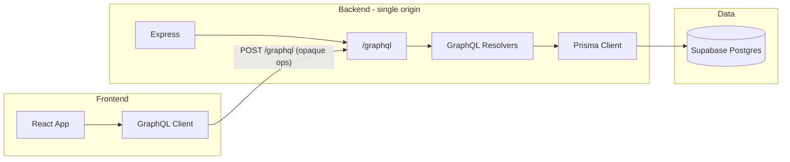

# GraphQL + Prisma + Supabase refactor with strict frontend isolation

## Current state

- **Backend:** Express app in [backend/server.js](backend/server.js) on port 3000; mounts [backend/supa/authRoutes.js](backend/supa/authRoutes.js) at `/supa/auth`. A separate [backend/index.js](backend/index.js) on port 5000 exposes `/users` and `/login` with its own Supabase client. [backend/supa/supabaseClient.js](backend/supa/supabaseClient.js) uses `SUPABASE_URL` + `SUPABASE_SERVICE_KEY`; all DB access is via `@supabase/supabase-js` in `supa/` and [backend/kundli-rag.js](backend/kundli-rag.js).
- **Frontend:** No Supabase usage. Calls REST endpoints: `http://localhost:3000/supa/auth/*` (auth, kundli, biodata, content, query) and `http://localhost:5000/supa/auth/chat/*` (chat). Chat routes are **not implemented** on the backend (chatController is a stub); frontend chat calls to port 5000 would fail.
- **Tables in use (inferred):** `auth`, `kundlis`, `system_prompts`, `user_generated_content`. No `chats`/`messages` tables exist yet.

## Target architecture

- Frontend talks **only** to one backend origin (e.g. `http://localhost:3000`) and a single endpoint: `**/graphql**`. No Supabase URL, anon key, table names, or schema are ever sent to or exposed to the frontend.
- Backend is the **only** place that knows about Supabase: it uses **Prisma** with `DATABASE_URL` / `DIRECT_URL` (Supabase Postgres). The service key is only in backend env; no Supabase client is used in frontend or in any response payload that could leak schema.
- Auth: login/signup become **GraphQL mutations**. They return an opaque session token (e.g. JWT or signed cookie) and **user id** (or “me” handle), not DB column names. All other operations require this token; resolvers resolve the identity server-side and use Prisma to load/update only that user’s data.
- Sensitive and admin operations stay in server-side resolvers; RLS is enabled on all tables as defense-in-depth (for any non–service-role access).

## 1. Database and Prisma

- **Connection:** Use Supabase Postgres via connection pooling in backend env only:
  - `DATABASE_URL` – pooler URL (e.g. port 6543, `?pgbouncer=true`) for Prisma Client.
  - `DIRECT_URL` – direct URL (e.g. port 5432) for migrations/introspection.
- **Prisma schema ([backend/prisma/schema.prisma](backend/prisma/schema.prisma)):** Define models matching current usage (and add chat support):
  - **Auth** – id, username, password, date_of_birth, place_of_birth?, time_of_birth?, email, gender?, is_active?, kundli_added?, role? (match existing [migration](backend/supabase/migrations/20250220000000_add_auth_role.sql)).
  - **Kundli** – id, user_id, biodata (Json), d1, d9, d10, charakaraka, vimsottari_dasa, other_readings (Json), created_at; relation to Auth.
  - **SystemPrompt** – name, prompt, is_active (used by RAG/insights).
  - **UserGeneratedContent** – user_id, kundli_id, remedies (Json), mantras (Json), routines (Json), created_at; relations to Auth and Kundli.
  - **Chat** (new) – id, user_id, name?, is_active, created_at; relation to Auth.
  - **Message** (new) – id, chat_id, question, ai_answer, created_at; relation to Chat.
- **Migrations:** Use Prisma migrations only for schema changes. Existing Supabase tables can be introspected once (`prisma db pull`) to align schema, then adopt Prisma migrations going forward; or create initial migration from the inferred schema and run against existing DB (with care for existing data). Ensure `directUrl` is used for migrations.
- **RLS:** In Supabase (SQL), enable RLS on all tables that hold user or sensitive data; add policies that restrict by `auth.uid()` or application user id where applicable. Backend will use a single service role connection (via Prisma); authorization is enforced in resolvers. RLS is an extra safeguard and required for the “strict security” checklist.

## 2. GraphQL layer

- **Server:** Add a GraphQL server (e.g. Apollo Server or `graphql-yoga`) mounted on the existing Express app at `POST /graphql` (single endpoint). No REST routes under `/supa/auth` in the long term.
- **Schema (conceptual):**
  - **Public types** – Names chosen for API, not DB: e.g. `User`, `Kundli`, `UserContent`, `Chat`, `Message`, `LoginResult`, `SignUpResult`. No raw table or column names in the schema or in error messages.
  - **Queries** – e.g. `me` (current user from context), `myBiodata`, `myContent`, `myKundliSummary`, `chats`, `chatMessages(chatId)`, and optionally a single `query` for the RAG Q&A (so frontend sends “query” + question, backend resolves user from token and runs existing RAG flow). All require authenticated context (session token).
  - **Mutations** – `login(username, password)`, `signup(...)`, `uploadKundli(file)`, `createChat`, `setChatInactive(chatId)`, `addMessage(chatId, question, aiAnswer)`, and optionally `generateKundliInsights` (or keep trigger-on-upload only). Admin-only operations (if any) restricted in resolvers by role (e.g. from Auth.role).
- **Context:** Each request’s context is built from the session token (cookie or `Authorization` header). Resolvers receive a `userId` (and optionally `role`); they use **only** Prisma and never expose Supabase or table names to the client. For login/signup, context may be empty; after that, all operations are authenticated.
- **Auth implementation:** Login/signup mutations validate credentials via Prisma (Auth model), then issue a JWT (or set a signed cookie) containing only opaque claims (e.g. `sub: userId`, `role`). No DB column names or Supabase identifiers in the token or in responses. `/query` (RAG) and any “list users” logic are moved into GraphQL resolvers and protected by the same context; no internal HTTP call to `/supa/auth/users`.

## 3. Backend refactor (remove `supa/` surface)

- **Remove or repurpose:**
  - [backend/supa/authRoutes.js](backend/supa/authRoutes.js) – delete; all operations become GraphQL.
  - [backend/supa/authController.js](backend/supa/authController.js) – logic (login, signup, uploadKundli, getBiodata, userDetails) moved into GraphQL resolvers using Prisma; no direct Supabase calls.
  - [backend/supa/user_controller.js](backend/supa/user_controller.js) – insights and content logic moved into resolvers or a shared service module that uses **Prisma** and, if needed, the existing LLM helpers.
  - [backend/supa/supabaseClient.js](backend/supa/supabaseClient.js) – remove; no Supabase client in backend. Prisma only.
  - [backend/supa/corsMiddleware.js](backend/supa/corsMiddleware.js) – keep CORS on Express once (e.g. in server.js); can remove this file if redundant.
  - [backend/supa/ensureSuperadmin.js](backend/supa/ensureSuperadmin.js) – reimplement using Prisma and call from server startup (same env vars: SUPERADMIN_*).
  - [backend/supa/llmClient.js](backend/supa/llmClient.js) – keep as a **backend-only** LLM utility; resolvers or RAG code call it, not Supabase.
- **RAG and kundli:** [backend/kundli-rag.js](backend/kundli-rag.js) today uses `supabase.from('kundlis')`. Replace with **Prisma** (e.g. `prisma.kundli.findFirst(...)`). Keep `kundliRowToChunks` and the rest of the RAG pipeline; only the data source becomes Prisma.
- **server.js:** Remove mount of `AuthRoutes` and any `fetch('.../supa/auth/users')`. Add GraphQL middleware at `/graphql`. Keep `/query` only if you retain it as a REST endpoint temporarily; otherwise expose the same behavior as a GraphQL mutation/query (e.g. `query(question)`) so the frontend never sees `/query` or internal user checks. Ensure `ensureSuperadmin()` runs at startup using Prisma.
- **index.js:** Deprecate or remove. Single entry point: `server.js` on one port (e.g. 3000). All frontend traffic to that origin and `/graphql` only (plus static/health if needed).

## 4. Frontend changes

- **Single API surface:** Frontend uses only the GraphQL endpoint (e.g. `VITE_GRAPHQL_ENDPOINT=http://localhost:3000/graphql`). No Supabase URL or key; no `localhost:5000`; no paths like `/supa/auth/...`.
- **Auth:** Replace [frontend/src/Auth/api.js](frontend/src/Auth/api.js) login/signup `fetch` calls with GraphQL mutations (`login`, `signup`). Store the returned token (and optionally user id) in memory or httpOnly cookie; send token in `Authorization` (or rely on cookie) for all subsequent requests.
- **Data fetching:** Replace REST calls in [frontend/src/pages/UserData.ts](frontend/src/pages/UserData.ts) (user details, biodata, content, query) with GraphQL queries/mutations using the same client. Replace [frontend/src/pages/chat-interface/chatAPI.ts](frontend/src/pages/chat-interface/chatAPI.ts) (today pointing at port 5000) with GraphQL queries/mutations for chats and messages. Remove all hardcoded `/supa/auth/...` and port 5000 references.
- **Errors and responses:** Do not expose raw Prisma or DB errors to the client. GraphQL errors should be generic (e.g. “Invalid credentials”, “Not found”); no table names or Supabase identifiers in messages.

## 5. Security checklist (enforced by design)

- **Service key only in backend:** Used only in Prisma connection (via `DATABASE_URL`); no Supabase client in frontend; no key in responses or in any frontend bundle.
- **No anon key in frontend:** Frontend does not use Supabase at all; no anon key, no Supabase URL.
- **RLS:** Enable RLS on all tables (auth, kundlis, system_prompts, user_generated_content, chats, messages); define policies (e.g. by user id / role) as defense-in-depth.
- **Auth and admin in backend:** Login, signup, and admin checks run in GraphQL resolvers; identity comes from token and Prisma (Auth.role, etc.); no client-side-only auth.
- **Safe operations only:** GraphQL schema exposes only intended operations; resolvers enforce “my data” (e.g. filter by `context.userId`). Schema/roles and table names stay behind the server.
- **CORS:** Keep CORS restricted to the frontend origin(s) in Express.

## 6. Implementation order (suggested)

1. Add Prisma (schema, `DATABASE_URL`/`DIRECT_URL`), run introspection or initial migration, and implement a minimal set of resolvers (e.g. login, me) without removing existing REST yet.
2. Add GraphQL server to Express; implement auth mutations and one or two queries; verify frontend can login and call `me` via GraphQL only.
3. Migrate kundli-rag and server.js RAG/query to use Prisma; expose RAG as a GraphQL query/mutation.
4. Move all auth, kundli, content, and user-details behavior from `supa/` into GraphQL resolvers (using Prisma + LLM where needed); then remove REST routes and Supabase client from backend.
5. Add Chat and Message models and resolvers; point frontend chat API to GraphQL; remove port 5000 and `/supa/auth` from frontend.
6. Run ensureSuperadmin with Prisma; add RLS policies in Supabase; final pass to ensure no Supabase or table names leak to the frontend.

## 7. Files to add/change (summary)

| Action           | Path / area                                                                                                                                                                                                                                                                                         |
| ---------------- | --------------------------------------------------------------------------------------------------------------------------------------------------------------------------------------------------------------------------------------------------------------------------------------------------- |
| Add              | `backend/prisma/schema.prisma` (generator + datasource + models Auth, Kundli, SystemPrompt, UserGeneratedContent, Chat, Message)                                                                                                                                                                    |
| Add              | `backend/src/graphql/schema.js` (or .ts) – type definitions and resolvers                                                                                                                                                                                                                           |
| Add              | `backend/src/graphql/context.js` – build context from token (userId, role)                                                                                                                                                                                                                          |
| Add              | `backend/src/services/authService.js` – login/signup using Prisma, JWT issue                                                                                                                                                                                                                        |
| Add              | `backend/src/services/kundliService.js` – RAG + insights using Prisma + existing LLM/kundli-rag logic                                                                                                                                                                                               |
| Change           | `backend/server.js` – mount GraphQL at `/graphql`, remove AuthRoutes, use Prisma for loadSystemPrompt and /query flow, call ensureSuperadmin(prisma)                                                                                                                                                |
| Change           | `backend/kundli-rag.js` – accept Prisma client or kundli row; no direct Supabase                                                                                                                                                                                                                    |
| Add/change       | `backend/ensureSuperadmin.js` (or keep under a new `backend/src/` structure) – use Prisma only                                                                                                                                                                                                      |
| Remove           | `backend/supa/` (after logic migrated)                                                                                                                                                                                                                                                              |
| Deprecate/remove | `backend/index.js` (single entry server.js)                                                                                                                                                                                                                                                         |
| Change           | Frontend: GraphQL client, single endpoint env var, replace [frontend/src/Auth/api.js](frontend/src/Auth/api.js), [frontend/src/pages/UserData.ts](frontend/src/pages/UserData.ts), [frontend/src/pages/chat-interface/chatAPI.ts](frontend/src/pages/chat-interface/chatAPI.ts) to use GraphQL only |
| Add              | Supabase SQL: RLS policies for all tables (separate migration or in Supabase dashboard)                                                                                                                                                                                                             |

## 8. Chat note

The current frontend expects chat endpoints on port 5000; those are not implemented. This plan adds Prisma models and GraphQL types/resolvers for Chat and Message so that the chat UI works through the single GraphQL backend with no Supabase or table names exposed to the client.