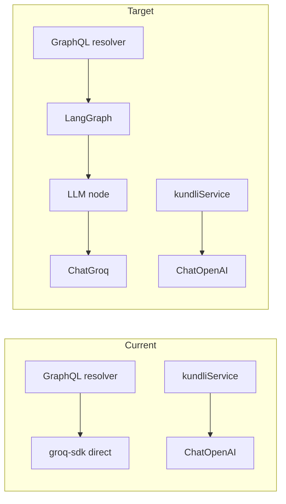

# LangGraph and Groq integration reconciliation

## Current state

- **[backend/src/services/groqChatService.ts](backend/src/services/groqChatService.ts)**  
Uses `**groq-sdk` directly** (not `@langchain/groq`). Comment in code: *"LangGraph/ChatGroq can be re-enabled when @langchain/core exports utils/standard_schema (see ERR_PACKAGE_PATH_NOT_EXPORTED with @langchain/groq)."*  
Implements: load system prompt, build user message with Kundli, call `client.chat.completions.create()` with streaming, aggregate text and return.
- **[backend/src/lib/llmClient.ts](backend/src/lib/llmClient.ts)**  
Uses only `**ChatOpenAI`** from `@langchain/openai`. No Groq, no LangGraph.
- **[backend/src/services/kundliService.ts](backend/src/services/kundliService.ts)**  
Uses `getLLMClient()` and `createJSONLLMClient()` (OpenAI only) for RAG and for generating remedies/mantras/routines.
- **LangGraph**  
`@langchain/langgraph` is in [backend/package.json](backend/package.json) but **not used** in any `src` file (no `StateGraph`, no graph-based flow).
- **Dependencies (today)**  
  - `@langchain/core`: ^1.1.20  
  - `@langchain/groq`: ^1.1.4 (depends on `groq-sdk` ^0.37.0 and imports `@langchain/core/utils/standard_schema`)  
  - `@langchain/langgraph`: ^1.1.4 (peer: `@langchain/core` ^1.1.16)  
  - `groq-sdk`: ^0.30.0 at repo root (version mismatch with @langchain/groq’s 0.37.x)

---

## Root cause of the blocker

`@langchain/groq`’s `chat_models` import:

```ts
import { SerializableSchema } from "@langchain/core/utils/standard_schema";
```

In **@langchain/core 1.1.20**, the `package.json` **exports** do not include `./utils/standard_schema`, so Node throws **ERR_PACKAGE_PATH_NOT_EXPORTED**.  
The public docs and npm indicate that **@langchain/core 1.1.31+** exposes this subpath; upgrading to a version that exports `utils/standard_schema` (e.g. 1.1.31 or latest 1.x) is the intended fix.

---

## Issues to address


| Issue                     | Detail                                                                                                                                             |
| ------------------------- | -------------------------------------------------------------------------------------------------------------------------------------------------- |
| 1. ChatGroq unusable      | `import { ChatGroq } from '@langchain/groq'` triggers resolution of `@langchain/core/utils/standard_schema`, which is not exported in core 1.1.20. |
| 2. Groq outside LangChain | Chat uses raw `groq-sdk`; no LangChain messages, no `.invoke()`/streaming via LangChain, no shared abstraction with the rest of the stack.         |
| 3. LangGraph unused       | No graph; Groq cannot be “called from LangGraph” until a graph exists that uses an LLM node.                                                       |
| 4. groq-sdk version split | Root `groq-sdk` 0.30.0 vs @langchain/groq’s 0.37.0 can cause type or behavior drift; align to one version.                                         |
| 5. Two LLM paths          | OpenAI (llmClient + kundliService) vs Groq (groqChatService) with no shared interface for “chat model” if we want one graph to support both later. |


---

## Recommended package changes

- **Upgrade @langchain/core** to a version that exports `utils/standard_schema` (e.g. **^1.1.31** or latest 1.x). Verify in `node_modules/@langchain/core/package.json` that `"./utils/standard_schema"` exists under `"exports"`.
- **Align @langchain/groq** with that core (e.g. keep **^1.1.4** or bump to latest; ensure peer `@langchain/core` range includes the chosen version).
- **Align @langchain/langgraph** so its peer `@langchain/core` is satisfied (e.g. **^1.1.16** is already satisfied by 1.1.31).
- **Set a single groq-sdk version**: use **^0.37.0** (or the version @langchain/groq declares) at the repo root so the app and ChatGroq share the same SDK; remove or override any nested 0.30.0 so there are no duplicate major/minor versions in the tree.
- **Optional**: Add **zod** and **zod-to-json-schema** if you introduce LangGraph state or tools with structured output and the current versions are not already compatible with LangGraph’s peer deps.

No new packages are strictly required beyond version alignment; the existing stack (LangChain core, LangGraph, @langchain/groq, groq-sdk) is sufficient once the export and version issues are fixed.

---

## Configuration

- **Environment**  
Keep **GROQ_API_KEY** for Groq. ChatGroq can be constructed with `apiKey: process.env.GROQ_API_KEY` (or leave unset and rely on env in the Groq client).  
Keep **OPENAI_API_KEY** and existing [backend/src/lib/llmClient.ts](backend/src/lib/llmClient.ts) for RAG/remedies until/unless you migrate those to Groq.
- **Model and options**  
In [backend/src/services/groqChatService.ts](backend/src/services/groqChatService.ts) you use `openai/gpt-oss-120b` with `reasoning_effort: 'medium'`, `stream: true`, `max_completion_tokens: 8192`. When moving to ChatGroq, pass the same model name and equivalent options (temperature, maxTokens, etc.) so behavior stays consistent. Groq-specific options (e.g. `reasoning_effort`) may need to be passed via `modelKwargs` or the call-options type for ChatGroq if supported.

---

## Implementation steps

### Phase 1: Unblock ChatGroq (packages and wiring)

1. **Upgrade and align packages**
  - In [backend/package.json](backend/package.json): set `@langchain/core` to **^1.1.31** (or latest 1.x), ensure `@langchain/groq` and `@langchain/langgraph` are compatible.  
  - Set **groq-sdk** to **^0.37.0** (or match @langchain/groq’s dependency).  
  - Run `npm install`, then run the backend (e.g. trigger a chat that uses Groq) and confirm there is no ERR_PACKAGE_PATH_NOT_EXPORTED when loading `@langchain/groq`.
2. **Refactor groqChatService to use ChatGroq**
  - Replace direct `groq-sdk` usage with:
    - `ChatGroq` from `@langchain/groq` (model `openai/gpt-oss-120b`, same temperature/max tokens).  
    - LangChain messages: `SystemMessage`, `HumanMessage` built from the current system prompt and the Kundli-backed user content.
  - Use `.invoke()` for non-streaming or `.stream()` for streaming; aggregate chunks if you keep the same “return full answerText + request/response payloads” API.  
  - Keep the same function signature and return shape (`ChatWithGroqResult`) so [backend/src/graphql/schema.ts](backend/src/graphql/schema.ts) (and any callers) do not need changes.  
  - Ensure GROQ_API_KEY is passed (constructor or env) and that Groq-specific params (e.g. `reasoning_effort`) are set via ChatGroq’s options if the type allows.
3. **Smoke test**
  - Run backend, send a chat message that hits `chatWithGroq`, and confirm the response is correct and that no runtime import errors occur.

### Phase 2: Call Groq from LangGraph (optional)

1. **Add a minimal LangGraph flow that uses Groq**
  - Create a small graph (e.g. in a new file under `backend/src/services/` or `backend/src/graphql/`) that:
    - Uses `StateGraph` with a simple state (e.g. `{ messages: BaseMessage[] }` or your existing message type).  
    - One node: call ChatGroq (or a runnable that wraps it) with the current state messages and return the new message(s).  
    - Edge: that node → END.
  - Compile the graph and expose an `invoke` (or `stream`) that accepts initial messages and returns the assistant reply.
2. **Wire the graph into chat**
  - Option A: From the same resolver that today calls `chatWithGroq`, call the new LangGraph `invoke` instead of (or behind) `chatWithGroq`, so that “chat” is implemented by a graph that uses Groq.  
  - Option B: Keep `chatWithGroq` as the current API and implement it internally by building messages and calling the LangGraph flow (so Groq is only ever called from within the graph).  
  - Ensure request/response payloads for logging (e.g. ChatLog) are still captured if required.
3. **Optional: shared “chat model” abstraction**
  - If you want one graph to support multiple backends (e.g. Groq vs OpenAI), introduce a thin factory (e.g. `getChatModel(): ChatGroq | ChatOpenAI`) based on env or feature flag, and use that inside the graph node instead of instantiating ChatGroq directly.

---

## Flow after reconciliation (conceptual)




- **Chat path**: Resolver → (optionally) LangGraph → node that calls **ChatGroq** (same model/options as today).  
- **RAG / remedies**: Can remain on OpenAI via [backend/src/lib/llmClient.ts](backend/src/lib/llmClient.ts) until you decide to migrate; no change required for “Groq + LangGraph” to work.

---

## Risks and mitigations

- **Version compatibility**: Upgrading @langchain/core may introduce breaking changes. Mitigation: upgrade in a branch, run backend and existing tests, and check LangChain/LangGraph release notes for 1.1.x.  
- **ChatGroq vs groq-sdk options**: Some Groq-specific fields (e.g. `reasoning_effort`) might not be in ChatGroq’s type. Mitigation: use `modelKwargs` or the call-options type from `@langchain/groq`; if unsupported, keep a thin groq-sdk path only for that option or open an issue/PR on langchainjs.  
- **LangGraph + tool-calling**: There are known limitations with ChatGroq + ToolNode for multiple tool calls; if you add tools later, test multi-call flows and consider workarounds (e.g. single-call or different model).

---

## Summary checklist

- Upgrade @langchain/core to a version that exports `utils/standard_schema` (e.g. 1.1.31+).  
- Align groq-sdk to ^0.37.0 (or @langchain/groq’s version).  
- Refactor groqChatService to use ChatGroq and LangChain messages; keep same external API.  
- (Optional) Add a LangGraph StateGraph whose node calls ChatGroq; wire chat to that graph.  
- Keep GROQ_API_KEY and existing model/options (openai/gpt-oss-120b, reasoning_effort, etc.) so behavior stays consistent.

