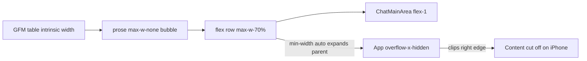

# Mobile chat responsiveness plan

## Diagnosis

The `/dashboard/chat` UI lives in [`ChatSection.tsx`](src/pages/chat-interface/ChatSection.tsx) → [`ChatMainArea.tsx`](src/pages/chat-interface/ChatMainArea.tsx). AI replies render as **GFM markdown** via `ReactMarkdown` + `remarkGfm` (not raw HTML). Tables in the screenshot (e.g. "Transits (May - July 2026)") are standard `<table>` elements from markdown.



**Why content is cut off on the right (not scrollable):**

1. **Wide tables and prose** — AI bubbles use `prose max-w-none` with no table wrapper. GFM tables keep their column width; they expand the flex child beyond the bubble.
2. **Missing `min-w-0` on flex children** — The message row (`max-w-[70%]`) and bubble `div` lack `min-w-0`, so flex items default to `min-width: auto` and refuse to shrink below content width.
3. **Global clip** — [`App.tsx`](src/App.tsx) line 97 sets `overflow-x-hidden` on the root. Overflow is hidden instead of scrollable, so users see a hard cutoff (matches your screenshot: left padding OK, right side gone).
4. **Secondary layout pressure** — [`Dashboard.tsx`](src/pages/Dashboard.tsx) `main.flex-1` has no `min-w-0`. [`TopNavigation.tsx`](src/pages/TopNavigation.tsx) uses `w-screen` + `ml-[calc(50%-50vw)]`, a common source of extra horizontal width on mobile Safari.

**Note on "HTML/DIV tables":** Chat does not use `dangerouslySetInnerHTML` or `rehype-raw`. Sidebar Kundli tables in [`KundliDataCard.tsx`](src/pages/chat-interface/KundliDataCard.tsx) already use `overflow-x-auto` (lines 221–222)—that pattern should be replicated for chat markdown tables.

---

## Recommended approach (minimal, high impact)

### 1. Fix the flex width chain (layout)

| File | Change |
|------|--------|
| [`Dashboard.tsx`](src/pages/Dashboard.tsx) | Add `min-w-0` to `main` (and optionally the outer `flex` wrapper). |
| [`ChatSection.tsx`](src/pages/chat-interface/ChatSection.tsx) | Root container: `flex h-screen relative` → add `min-w-0 w-full max-w-full overflow-hidden` (contains chat column without relying on page-level clip). |
| [`ChatMainArea.tsx`](src/pages/chat-interface/ChatMainArea.tsx) | Message row + bubble: add `min-w-0`; bubble add `w-full overflow-hidden`. |

### 2. Responsive message bubble width (mobile-first)

In [`ChatMainArea.tsx`](src/pages/chat-interface/ChatMainArea.tsx) (~line 82), replace fixed `max-w-[70%]` with something like:

```tsx
max-w-[calc(100%-2.5rem)] sm:max-w-[85%] lg:max-w-[70%]
```

(`2.5rem` ≈ avatar + gap.) On iPhone, AI messages should use almost the full column width; desktop keeps the narrower bubble.

### 3. Scrollable markdown tables (core fix for tables)

Add custom `ReactMarkdown` components in `ChatMainArea` (or a small new [`ChatMarkdown.tsx`](src/pages/chat-interface/ChatMarkdown.tsx) if you prefer reuse):

```tsx
table: ({ children }) => (
  <div className="my-4 w-full max-w-full overflow-x-auto overscroll-x-contain rounded-lg border border-white/10">
    <table className="w-max min-w-full text-left text-sm border-collapse">
      {children}
    </table>
  </div>
),
```

Also override `th` / `td` if needed to avoid excessive padding on small screens (`prose-th:px-2 prose-td:px-2` or inline on cells).

This mirrors [`KundliDataCard.tsx`](src/pages/chat-interface/KundliDataCard.tsx) behavior: **table scrolls inside the bubble**, page does not grow horizontally.

### 4. Text wrapping inside prose

On the AI bubble `prose` container, add:

- `break-words` / `[overflow-wrap:anywhere]` for long tokens (URLs, Sanskrit terms)
- `prose-pre:overflow-x-auto` (code blocks)
- Optional `prose-sm sm:prose-base` for slightly smaller type on mobile

User bubbles: same `break-words` on the `<p>` for long questions.

### 5. Input row and footer (secondary cutoff in screenshot)

In the bottom section of [`ChatMainArea.tsx`](src/pages/chat-interface/ChatMainArea.tsx):

- Input row (`flex items-end gap-4`): add `min-w-0 w-full`, use `gap-2 sm:gap-4`
- Footer line 272: add `text-center max-w-full px-1 break-words` (or shorten copy on `max-sm` with `hidden sm:inline` for the long suffix)

The textarea already has `min-w-0 flex-1`; the parent flex row likely lacked `min-w-0`, causing placeholder clipping.

### 6. Root overflow policy

**Prefer fixing overflow sources** over keeping a global clip.

- Option A (recommended): Remove or narrow `overflow-x-hidden` on [`App.tsx`](src/App.tsx) once chat/dashboard use `min-w-0` + contained table scroll.
- Option B (conservative): Keep root clip but ensure chat never overflows (steps 1–5). Verify no regression on landing/auth pages.

If horizontal bleed persists after chat fixes, adjust [`TopNavigation.tsx`](src/pages/TopNavigation.tsx): replace `w-screen ml-[calc(50%-50vw)]` with `w-full` inside the dashboard shell.

### 7. Chat viewport height (optional, separate from horizontal clip)

`ChatSection` uses `h-screen` while sitting **below** [`TopNavigation`](src/pages/TopNavigation.tsx), which can cause double scroll on mobile. Consider:

```tsx
className="flex min-h-0 flex-1 w-full max-w-full ..."
```

with Dashboard `main` as `flex flex-col min-h-[calc(100dvh-...)]` or `h-[calc(100dvh-var(--nav))]`. Low priority unless you also see vertical layout issues.

---

## Out of scope (unless you want it later)

- **Card/stacked tables on mobile** — nicer UX but more work; horizontal scroll is the right first step.
- **Raw HTML in AI responses** — would require `rehype-raw` + sanitization; not used today.
- **Backend prompt changes** — shorter tables help, but frontend should handle wide tables regardless.

---

## Testing plan

1. Chrome DevTools → iPhone 14/SE (390px width), `/dashboard/chat`, send or load a reply with a multi-column table (like your transit example).
2. Confirm: full text visible or **horizontally scrollable inside the bubble**; no page-level right cutoff.
3. Check input placeholder and footer text fully visible.
4. Desktop regression: bubbles still ~70% width on large screens; table scroll only when needed.
5. Optional: small Vitest/RTL test in a new `ChatMarkdown.test.tsx` asserting the table wrapper renders `overflow-x-auto`.

---

## Files to touch (estimated)

| File | Purpose |
|------|---------|
| [`ChatMainArea.tsx`](src/pages/chat-interface/ChatMainArea.tsx) | Primary: bubble width, `min-w-0`, markdown table wrapper, text wrap, input/footer |
| [`ChatSection.tsx`](src/pages/chat-interface/ChatSection.tsx) | Layout containment |
| [`Dashboard.tsx`](src/pages/Dashboard.tsx) | `min-w-0` on main |
| [`App.tsx`](src/App.tsx) | Optional: relax `overflow-x-hidden` |
| [`TopNavigation.tsx`](src/pages/TopNavigation.tsx) | Optional: fix `w-screen` bleed |
| New `ChatMarkdown.tsx` (optional) | Shared markdown component map |

No backend or Prisma changes required.
