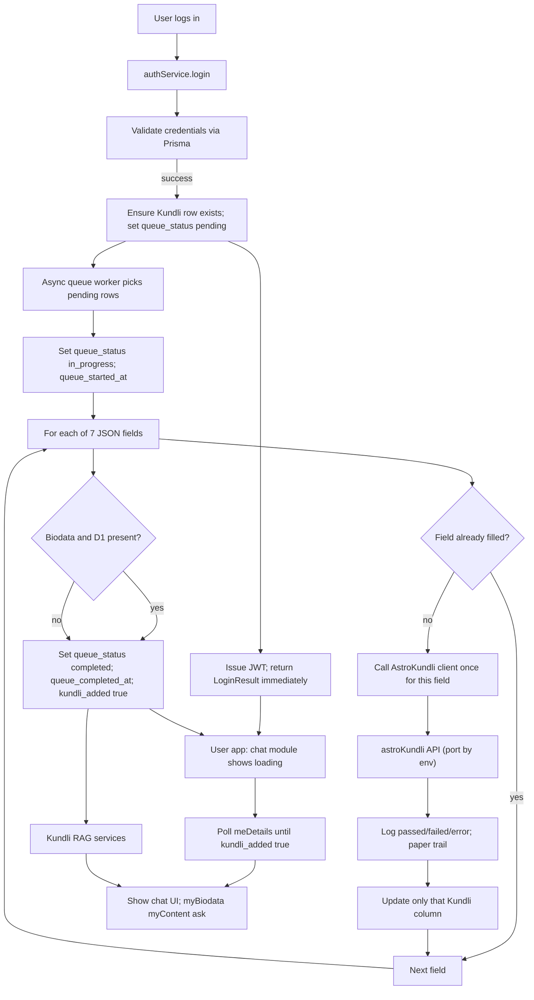

# Multi-environment config and astroKundli login integration

## High-level goals

- **Environments**: Standardize **local**, **staging**, and **production** environment handling across backend, frontend, and admin apps, using `.env` files and minimal `NODE_ENV`/`APP_ENV` conditionals in code.
- **AstroKundli integration**: Horoscope data is gathered **asynchronously** by a **queue process** that uses the dedicated AstroKundli client. On login we **enqueue** the user’s Kundli sync (create or attach to a Kundli row with queue status **pending**); the queue worker then fills only **missing** JSON fields (biodata, d1, d7, d9, d10, charakaraka, vimsottari_dasa) one call per field. The **Kundli** table gets **queue status** and **timestamps** so the front-end can keep the chat module in a "loading" state until a **minimal viable** set (biodata + d1) is present; once those two are back, the user can use chat even if other pulls failed or are still pending. **Logging** and a **paper trail** record each 3rd party call (passed / failed / errored). **Backend unit and integration tests** cover the async process and AstroKundli integration so changes don’t break downstream.

## 1. Environment strategy across apps

- **1.1 Define env naming and conventions**
  - **Backend (`backend/`)**
    - Keep using `NODE_ENV` with values `development`, `staging`, `production`.
    - Optionally introduce `APP_ENV` (`local` | `staging` | `production`) if we need a friendlier switch, but default to `NODE_ENV` branching.
    - Add new env vars to `backend/.env.example`:
      - `ASTROKUNDLI_BASE_URL_LOCAL=http://localhost:8765`
      - `ASTROKUNDLI_BASE_URL_STAGING=http://localhost:8766`
      - `ASTROKUNDLI_BASE_URL_PROD=http://localhost:8767`
      - `ASTROKUNDLI_API_KEY=...` (if the 3rd party requires API keys).
  - **Frontend user app (`frontend/`)**
    - Use Vite's built-in env modes with separate files:
      - `.env.development`, `.env.staging`, `.env.production`.
    - Ensure each defines `VITE_GRAPHQL_ENDPOINT` for its environment (e.g. `https://staging-api.example.com/graphql`).
  - **Admin app (`admin-app/`)**
    - Also use `.env.development`, `.env.staging`, `.env.production` with:
      - `VITE_API_BASE` per environment (e.g. local `http://localhost:3000`, staging `https://staging-api.example.com`).
      - `VITE_GRAPHQL_ENDPOINT=/graphql` (path only) so the same code composes the full URL.
- **1.2 Introduce a backend env helper module**
  - Create `backend/src/config/env.ts` that centralizes environment-specific logic:
    - `getNodeEnv(): 'development' | 'staging' | 'production'` (default `development`).
    - `getAstroKundliBaseUrl()`: returns one of `ASTROKUNDLI_BASE_URL_LOCAL/STAGING/PROD` depending on `NODE_ENV` (with clear errors if missing).
    - `getAstroKundliApiKey()` if required.
  - Refactor any future environment branching (e.g. debug-only routes, prod-only behaviors) to call these helpers instead of sprinkling `process.env.NODE_ENV` checks.
- **1.3 Adjust backend server startup to respect environments**
  - In `[backend/server.ts](backend/server.ts)`:
    - Import `getNodeEnv()` and log the active env clearly on startup.
    - Keep `PORT = process.env.PORT ?? 3000`, but document recommended ports per env in `README` (e.g. same app port, but different 3rd party ports).
    - Optionally move CORS origins into env (`ALLOWED_ORIGIN_DEV`, `ALLOWED_ORIGIN_STAGING`, `ALLOWED_ORIGIN_PROD`) and select based on `getNodeEnv()` for cleaner multi-env deployments (not required for astroKundli, but aligned with the same pattern).
- **1.4 Verify frontend/admin env usage**
  - **User app**: `[frontend/src/lib/graphql.ts](frontend/src/lib/graphql.ts)` already respects `VITE_GRAPHQL_ENDPOINT` with a local default.
    - Confirm behavior in all three modes by configuring `.env.`* files and making sure we never hardcode `http://localhost:3000` outside of this helper.
  - **Admin app**: `[admin-app/src/lib/graphql.ts](admin-app/src/lib/graphql.ts)` already uses `VITE_API_BASE` + `VITE_GRAPHQL_ENDPOINT`.
    - Ensure there are no other hardcoded URLs in admin pages; if any exist, refactor to import and use the same helper.

## 2. Design the astroKundli client in the backend

- **2.1 Kundli JSON fields to fill from AstroKundli (hard-coded in code)**
  - The [Kundli](backend/prisma/schema.prisma) model has these JSON columns that are filled from the 3rd party API. All other columns are **not** requested from AstroKundli:
    - **Filled from API (7 fields):** `biodata`, `d1`, `d7`, `d9`, `d10`, `charakaraka`, `vimsottari_dasa`.
    - **Not from API:** `id`, `user_id`, `other_readings`, `created_at` (our own metadata; `other_readings` remains as-is or is populated separately).
  - In backend code, define a single ordered list or enum of these seven field names and use it when deciding what to request and what to update.
- **2.1.1 Request parameter for each Kundli column (one call per field)**
  - The AstroKundli API returns **only one data point (one JSON payload) per request**, not the full horoscope. Each missing field therefore requires a **separate POST** to the same endpoint, with a parameter indicating which slice to return. Use the following mapping in the request body (param name and value per column). Confirm param name with the actual API; if the API uses a different key (e.g. `chart`, `exportType`), use that key with the same values.
  - **Request param:** `type` (or the API’s equivalent, e.g. `chart` / `exportType`). **Value sent for each column:**
  - **biodata** → `type: "biodata"`
  - **d1** → `type: "d1"`
  - **d7** → `type: "d7"`
  - **d9** → `type: "d9"`
  - **d10** → `type: "d10"`
  - **charakaraka** → `type: "charakaraka"`
  - **vimsottari_dasa** → `type: "vimsottari_dasa"`
  - Example request body for a single call (e.g. to fetch only `d1`):
    - `{ "dob": "1996-12-07", "tob": "10:34:00", "place": "Chennai, IN", "type": "d1", "ayanamsa": "LAHIRI" }`
  - Sync logic: for each of the 7 fields that is not filled on the Kundli row, call the client once with the corresponding `type` value; parse the single JSON payload and write it into that column only.
- **2.1.2 chartType vs exportType (param naming)**
  - **There is no functional difference** between "chartType" and "exportType" in this plan: both refer to the **same request parameter** that tells the 3rd party API which single data slice to return (biodata, d1, d7, d9, d10, charakaraka, vimsottari_dasa). Use whichever name the AstroKundli API actually expects (e.g. `type`, `chart`, `chartType`, or `exportType`). In code, use one constant for the param name (e.g. read from config or hard-code to match the API docs) and the same set of string values above.
- **2.2 Create a dedicated astroKundli client module (one response per call)**
  - Add `[backend/src/lib/astroKundliClient.ts](backend/src/lib/astroKundliClient.ts)` with responsibilities:
    - Build the base URL from `getAstroKundliBaseUrl()` and append `/api/export-horoscope`.
    - **One request = one data point:** each POST returns a single JSON object for the requested `type` (biodata, d1, d7, d9, d10, charakaraka, vimsottari_dasa). There is no “full horoscope” response; the sync logic must call the API **once per missing field** with the appropriate `type` (see 2.1.1).
    - Implement `fetchHoroscopeChart(params: AstroKundliRequestParams, type: KundliJsonField): Promise<Record<string, unknown>>` (or a typed union per field). The client sends `dob`, `tob`, `place`, `type`, and optional `ayanamsa` (and optionally `lat`/`lon`/`tz` if supported); it returns the single JSON payload that will be stored in the corresponding Kundli column.
    - Prepare the POST with `Content-Type: application/json` and optional API key header; handle timeouts and clear error types (network vs. validation).
  - **Response types and parsing (example):** Define TypeScript types for each of the seven response shapes so we can validate and map into Prisma’s `Json` type. The API may return a wrapper like `{ data: { ... } }` or the raw object; the example below assumes a top-level `data` key. Adjust to the real response shape.
  - **Example response and TypeScript types**
  - Assume the API returns a single JSON object per call, e.g. for `type: "biodata"`:

```json
    { "data": { "date": "1996-12-07", "time": "10:34:00", "place": "Chennai, IN", "lat": 13.0827, "lon": 80.2707, "timezone": "Asia/Kolkata", "ayanamsa": "LAHIRI" } }
    

```

- For chart types (d1, d7, d9, d10), assume an array of placements or a keyed object:

```json
    { "data": { "planets": [...], "houses": [...], "chart": "D1" } }
    

```

- For `charakaraka` / `vimsottari_dasa`, assume structured objects; exact keys depend on the API.
- In code, define a **union or overloaded type** for the response and a **parser per field** that returns a value suitable for Prisma `Json` (i.e. plain JSON-serializable object):

```ts
    // Kundli column names we request from the API (one call per field)
    export const KUNDLI_JSON_FIELDS = ['biodata', 'd1', 'd7', 'd9', 'd10', 'charakaraka', 'vimsottari_dasa'] as const;
    export type KundliJsonField = (typeof KUNDLI_JSON_FIELDS)[number];

    // Request body sent to POST /api/export-horoscope
    export interface AstroKundliRequestParams {
      dob: string;   // "YYYY-MM-DD" or "YYYY,MM,DD"
      tob: string;   // "HH:MM:SS"
      place: string; // "City, Country" or lat/lon/tz if API supports
      ayanamsa?: string; // default "LAHIRI"
    }

    // API returns one slice per call; wrapper shape to be confirmed with actual API
    export interface AstroKundliResponse<T = Record<string, unknown>> {
      data?: T;
      error?: string;
    }

    // Per-field response types (adjust to actual API response)
    export interface AstroKundliBiodata { date?: string; time?: string; place?: string; lat?: number; lon?: number; timezone?: string; ayanamsa?: string; [k: string]: unknown; }
    export interface AstroKundliChart { planets?: unknown[]; houses?: unknown[]; chart?: string; [k: string]: unknown; }
    export interface AstroKundliCharakaraka { [k: string]: unknown; }
    export interface AstroKundliVimsottariDasa { periods?: unknown[]; [k: string]: unknown; }

    // Parse response into a single object we store in Prisma Json column
    // Prisma.JsonValue from '@prisma/client'
    function parseAstroKundliResponse<T>(res: AstroKundliResponse<T>): Prisma.JsonValue {
      if (res.error) throw new Error(res.error);
      const raw = res.data ?? res;
      return raw as unknown as Prisma.JsonValue;
    }
    

```

- For each of the 7 fields, the client (or a small mapper) should:
  1. Call `fetchHoroscopeChart(params, field)` with the correct `type` from 2.1.1.
  2. Parse the response (e.g. with `parseAstroKundliResponse` or a field-specific parser if needed).
  3. Return a value that is written directly into the corresponding column (`biodata`, `d1`, `d7`, `d9`, `d10`, `charakaraka`, `vimsottari_dasa`) as Prisma `Json`.
- If the real API uses a different wrapper (e.g. no `data`, or a different key for the payload), update the interface and parser accordingly; the important point is that **one call yields one JSON object**, which we store in exactly one of the seven Kundli columns.
- **2.3 Environment-sensitive endpoint selection**
  - Implement `getAstroKundliBaseUrl()` roughly as:
    - If `NODE_ENV === 'production'`, read `ASTROKUNDLI_BASE_URL_PROD`.
    - Else if `NODE_ENV === 'staging'`, read `ASTROKUNDLI_BASE_URL_STAGING`.
    - Else (default) use `ASTROKUNDLI_BASE_URL_LOCAL`.
  - This ensures that **no code changes** are needed when switching between local, staging, and prod; only env vars change.
- **2.4 Map our stored user profile onto the API shape**
  - In `[backend/src/lib/astroKundliClient.ts](backend/src/lib/astroKundliClient.ts)`, or a small helper module, define a mapper:
    - Input: a user record from the `Auth` Prisma model (with encrypted or plaintext `date_of_birth`, `place_of_birth`, `time_of_birth`).
    - Use `decrypt()` from `[backend/src/lib/encrypt.ts](backend/src/lib/encrypt.ts)` to obtain plaintext DOB/TOB/place when encryption is active.
    - Normalize fields to the API-required formats:
      - `dob`: `YYYY-MM-DD` (or `YYYY,MM,DD` if we decide to stick to their first example), derived from stored string.
      - `tob`: `HH:MM:SS` 24-hour; if we currently store `HH:MM`, decide whether to default seconds to `:00`.
      - `place`: use `place_of_birth` string (e.g. "Chennai, IN"); later we can expand to lat/lon/tz if we begin storing those.
      - Optionally support `ayanamsa` defaulting to `"LAHIRI"`.

## 3. Kundli queue status and asynchronous sync

- **3.1 Add queue status and timestamps to the Kundli table**
  - Extend the [Kundli](backend/prisma/schema.prisma) model with fields required for the async queue and front-end visibility:
    - **queue_status** (String, required or with default): one of `"pending"` | `"in_progress"` | `"completed"`. Indicates whether the Kundli row is waiting for sync, currently being synced, or finished (at least for the current run).
    - **queue_started_at** (DateTime?, optional): when the queue worker last started processing this row.
    - **queue_completed_at** (DateTime?, optional): when the queue worker last finished (set when status moves to `completed` or when worker stops after minimal viable is reached).
  - Optionally add **last_sync_error** (String?, optional) or a small **sync_log** (Json?) to store the last error message or a summary of which fields failed; alternatively rely on application logs only (see 5.2 / 3.5).
  - Run a Prisma migration after adding these columns.
- **3.2 Async queue process (hand off horoscope gathering)**
  - **Do not** perform AstroKundli fetches synchronously during login. Instead:
    - **On login (or signup):** After successful auth, ensure the user has a Kundli row (create one if none) with `queue_status = "pending"`. Optionally push a job onto an in-process queue or a job table (e.g. `kundli_sync_jobs` with `user_id`, `created_at`) so a worker can pick it up. Return the JWT and login response immediately.
    - **Queue worker:** A dedicated async process (e.g. a background loop, a cron-invoked handler, or a job worker reading from a queue) periodically selects users whose Kundli has `queue_status = "pending"` (or jobs from a job table). For each user it:
      1. Loads the Auth profile (DOB/TOB/place, decrypting if needed) and the latest Kundli row.
      2. Sets `queue_status = "in_progress"` and `queue_started_at = now()`.
      3. For each of the 7 JSON fields that is **not** filled, calls the AstroKundli client once with the corresponding `type` (see 2.1.1); on success, writes the JSON into that column only; on failure, logs and continues to the next field.
      4. After processing all missing fields (or when minimal viable is reached — see 3.3), sets `queue_status = "completed"` and `queue_completed_at = now()`; if biodata and d1 are both present, sets `auth.kundli_added = true` so the front-end can enable chat.
    - The queue process uses the same [AstroKundli client](backend/src/lib/astroKundliClient.ts) and the same env-based base URL so all 3rd party calls are consistent and environment-aware.
- **3.3 Minimal viable: biodata + d1 to enable chat**
  - Third-party calls can fail or error; we do **not** require all 7 fields to be present. As soon as **biodata** and **d1** JSON are both successfully stored on the Kundli row:
    - Set `auth.kundli_added = true` for that user (if not already), and set `queue_status = "completed"` (and `queue_completed_at`) so the front-end can treat the Kundli as "ready for chat".
  - The front-end can consider the user "ready" when `kundli_added === true` (or when a dedicated field/query indicates that biodata and d1 exist). Remaining fields (d7, d9, d10, charakaraka, vimsottari_dasa) can continue to be fetched in the background or retried later without blocking chat.
- **3.4 Chat module "loading" until sync is ready**
  - While the user is logged in but their Kundli has **not** yet reached the minimal viable state (biodata + d1 present and `kundli_added = true`), the **chat module stays in a "loading" state** (e.g. spinner or "Syncing your chart…"). The front-end should:
    - Query or derive from existing APIs (e.g. `meDetails` with `kundli_added`, or a new field such as `kundliQueueStatus` / `kundliReadyForChat`) whether the user can use chat.
    - Poll or re-query periodically until `kundli_added` (or equivalent) is true, then show the chat UI.
  - No synchronous blocking of login; the user sees the app immediately and only the chat area waits for the queue to finish the minimal set.
- **3.5 Logging and paper trail for each data pull**
  - For **every** call to the AstroKundli client (each of the 7 field requests), add structured logging that records:
    - **User/Kundli:** `user_id`, `kundli_id` (no PII).
    - **Request:** which field (biodata, d1, d7, etc.), request payload (e.g. type, dob/tob/place hashed or redacted if needed).
    - **Outcome:** `passed` | `failed` | `error` (e.g. HTTP error, timeout, parse error).
    - **Timestamp** and **duration**.
  - Prefer a single log line per call (e.g. JSON or key-value) so logs can be aggregated to see which pulls passed, which failed, and which errored. Optionally write a summary to a `sync_log` table or a `last_sync_error` on Kundli for admin visibility; the main requirement is a clear **paper trail** in application logs for debugging and auditing.

## 4. Login flow: enqueue only; reuse RAG and admin

- **4.1 Login behavior (enqueue, no inline sync)**
  - Existing login in `[backend/src/services/authService.ts](backend/src/services/authService.ts)` continues to validate credentials and issue JWT. After success:
    - Fetch or create the latest Kundli row for the user; set (or leave) `queue_status = "pending"` and ensure the row exists so the queue worker can pick it up. Do **not** call the AstroKundli API during the login request.
    - Return the same login response (token, user, role) immediately.
  - Signup can similarly create a Kundli row with `queue_status = "pending"` so the new user is synced by the queue.
- **4.2 Reuse existing Kundli/RAG pipeline**
  - Keep all existing GraphQL queries and services that rely on `Kundli` and `UserGeneratedContent` (`myBiodata`, `myContent`, `ask`, RAG in `kundli-rag.ts` and `kundliService.ts`). Once the queue has filled biodata and d1 (and optionally more), these features work without change.
  - Optionally **deprecate or hide** the `uploadKundli` mutation from the main user-facing UI if the new flow fully replaces manual upload.
- **4.3 Admin visibility and optional re-sync**
  - Admin app continues to use `adminGetUserKundli` and UserDetail; expose the new `queue_status` and timestamps in the admin UI so support can see sync state. Add an `adminRefreshUserKundli(userId)` mutation that sets the user’s latest Kundli back to `queue_status = "pending"` (and optionally enqueues a job) so the queue re-runs and fills any still-missing fields.

## 5. Frontend and admin app implications

- **5.1 User app: chat "loading" until Kundli is ready**
  - Login response shape is unchanged (token, user, role). Kundli sync runs **asynchronously** via the queue.
  - The **chat module** must stay in a **"loading"** state (e.g. "Syncing your chart…" or spinner) until the user’s Kundli has reached the **minimal viable** state (biodata + d1 present, `kundli_added = true`). Use existing `meDetails` (or a new field such as `kundliQueueStatus` / `kundliReadyForChat`) to determine readiness; poll or re-query until the backend indicates the user can use chat, then show the chat UI.
  - Once ready, `myBiodata`, `myContent`, and `ask` work as today with the queue-populated data.
- **5.2 Admin app**
  - Expose **queue_status**, **queue_started_at**, and **queue_completed_at** (and optional `last_sync_error`) in the admin user/Kundli view so support can see sync state. Wire `adminRefreshUserKundli(userId)` into `[admin-app/src/pages/UserDetail.tsx](admin-app/src/pages/UserDetail.tsx)` to re-enqueue a user’s Kundli sync.

## 6. Error handling, observability, and security

- **6.1 Error handling in the queue worker**
  - For each AstroKundli call in the queue: catch network/HTTP errors and validation/parse errors separately; log outcome (passed / failed / error) and continue to the next field or mark the row with `queue_status = "completed"` and optional `last_sync_error` when the worker finishes. Login is never blocked; only the queue and chat readiness are affected.
- **6.2 Logging and paper trail (see also 3.5)**
  - **Per-call logging:** Every request to the AstroKundli client must produce a structured log entry: `user_id`, `kundli_id`, field name (biodata, d1, …), outcome (passed | failed | error), timestamp, duration. This gives a full **paper trail** of which data pulls succeeded, failed, or errored.
  - **Environment:** Include which env (local/staging/prod) and base URL (or port) in logs so support can correlate with the 3rd party endpoint.
  - Use these logs for debugging and to verify the async process and integration; feed them into log aggregation in staging/production.
- **6.3 Secrets management**
  - No real API keys in repo: `ASTROKUNDLI_API_KEY` and similar only in `.env`; document variable names in `.env.example`. Document expected values in `backend/README.md` and frontend/admin README as needed.

## 7. Backend unit and integration tests

- **7.1 Unit tests**
  - **AstroKundli client:** Test request building (param name for type/chartType/exportType, body shape), response parsing (`parseAstroKundliResponse`), and error handling with **mocked** HTTP (e.g. `nock` or `msw`). Test that the correct base URL is used per `NODE_ENV` (mock env).
  - **Queue / sync logic:** Unit test the function that determines which of the 7 fields are missing (`isJsonFieldFilled`), the logic that sets `queue_status` and `kundli_added` when biodata + d1 are present, and the mapping from Auth (encrypted) to AstroKundli request params (with decryption mocked if needed).
  - **Env config:** Test `getNodeEnv()` and `getAstroKundliBaseUrl()` for each environment value.
- **7.2 Integration tests**
  - **Queue worker + AstroKundli (mocked 3rd party):** Run the queue worker against a test DB; mock the AstroKundli HTTP endpoint to return one JSON payload per `type`. Assert that missing fields are requested one at a time, that the Kundli row is updated only for those fields, and that `queue_status` and `queue_completed_at` and `kundli_added` are set as specified when biodata and d1 are present.
  - **Login → enqueue:** Test that login creates or updates a Kundli row with `queue_status = "pending"` and does not call the 3rd party API during the request.
  - **Downstream:** After the queue has "filled" a Kundli (via mocks), run existing or new integration tests for `myBiodata`, `myContent`, and `ask` (RAG) to ensure code changes do not break these flows.
- **7.3 CI**
  - Run backend unit and integration tests in CI on every change so regressions in the async process or AstroKundli integration are caught before merge or deploy.

## 8. Suggested implementation order

- **Step 1: Environment scaffolding** — `.env.example`, `backend/src/config/env.ts`, per-env Vite files.
- **Step 2: Kundli schema** — Add `queue_status`, `queue_started_at`, `queue_completed_at` (and optional `last_sync_error`); run migration.
- **Step 3: AstroKundli client** — Implement client with env-based URL and one-call-per-field; add unit tests with mocked HTTP.
- **Step 4: Queue worker** — Implement the async process that picks pending Kundli rows, calls the client for each missing field, updates DB and sets minimal viable (biodata + d1) and logging; add unit + integration tests.
- **Step 5: Login/signup** — Enqueue on login (create/update Kundli with `queue_status = "pending"`); no inline sync.
- **Step 6: Frontend** — Chat module shows "loading" until `kundli_added` (or equivalent); poll `meDetails` or new field.
- **Step 7: Admin** — Expose queue status and timestamps; add `adminRefreshUserKundli` and wire to UI.
- **Step 8: Staging/production** — Configure envs, smoke test login and queue, verify logs and paper trail.

## 9. Flow diagram (conceptual)




