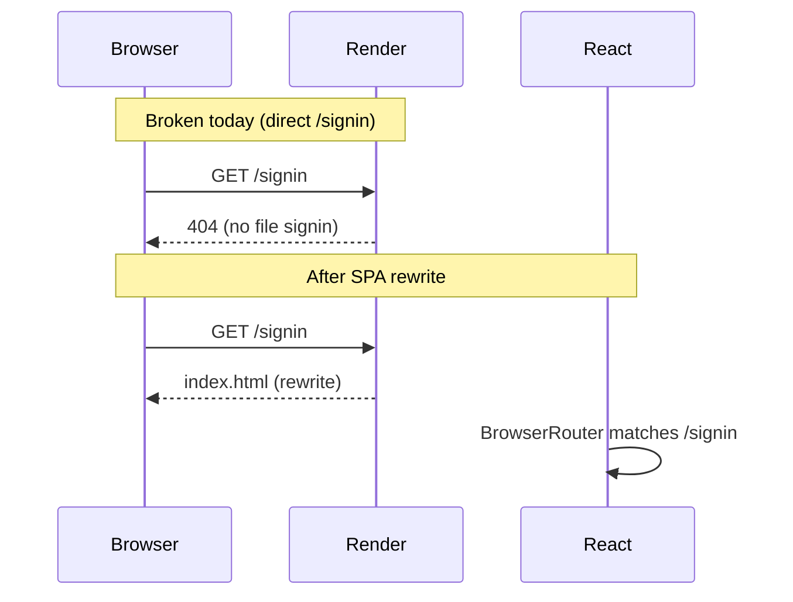

# SPA routing and 10-minute idle logout

## Problem summary

| Issue | Root cause |
|-------|------------|
| `https://aiastraweb.onrender.com/signin` → Not found | Host returns 404 for unknown static paths before React loads. React routing is already correct ([`src/routes.tsx`](src/routes.tsx) defines `/signin`). |
| User stays “logged in” after 10+ min idle | UI restores from `astroUser` only; JWT stays in `localStorage` for 7 days (server); logout never calls `clearAuth()`; no idle timer. |



---

## Part 1: Direct URL access to `/signin` (and other routes)

### What is already correct

- [`src/routes.tsx`](src/routes.tsx) — `/signin`, `/signup`, `/dashboard/*`, catch-all `*`
- [`src/App.tsx`](src/App.tsx) — `BrowserRouter`
- [`render.yaml`](render.yaml) — intended Render static site rewrite:

```yaml
routes:
  - type: rewrite
    source: /*
    destination: /index.html
```

### What to do (no React code change required)

The 404 is almost certainly **Render dashboard config**, not missing routes. If the static site was created manually, Blueprint rules in `render.yaml` may never have been applied.

**Operational fix (required):**

1. Render Dashboard → Static Site `aiastraweb` → **Redirects / Rewrites**
2. Add rule: **Source** `/*` → **Destination** `/index.html` → **Action: Rewrite** (not Redirect)
3. Redeploy / sync from repo if using Blueprint

**Verify:** Hard-open `https://aiastraweb.onrender.com/signin` → HTTP 200, Sign In UI (not host 404). Local check: `npm run build && npm run preview` then open `/signin`.

**Optional repo hardening (small doc-only or comment):** Add a short **Deploy** note in [`docs/README.md`](docs/README.md) §4.1 linking to [Render rewrites docs](https://render.com/docs/redirects-rewrites) so future deploys do not drop the rule.

---

## Part 2: 10-minute idle logout (frontend — this repo)

### Current auth gaps to fix

1. **`handleLogout` in [`src/App.tsx`](src/App.tsx)** removes `astroUser` / `isAuthenticated` but not `token` / `userId`.
2. **[`src/Auth/AuthProvider.tsx`](src/Auth/AuthProvider.tsx)** defines a second `handleLogout` injected via `cloneElement`, which can override App’s handler and also skips `clearAuth()`.
3. **Session restore on load** ([`App.tsx` L41–47](src/App.tsx)) sets `isAuthenticated` from `astroUser` alone, ignoring JWT expiry or idle time.

### Target behavior (10 minutes, per your choice)

- While authenticated: track user activity (mouse, keyboard, touch, scroll, click, focus).
- If **no activity for 10 minutes**: run one centralized logout, clear all client auth keys, navigate to `/signin` (optionally `?reason=idle`).
- On **every full page load / tab restore** (mobile backgrounding): read `lastActivityAt`; if older than 10 minutes, logout before showing dashboard.
- **Meta refresh safety net:** When logged in, maintain a dynamic `<meta http-equiv="refresh" content="N;url=/signin?reason=idle">` where `N` is seconds until idle deadline; reset `N` on activity. If JS timers are suspended (common on mobile), the hard reload still lands on sign-in and triggers the boot-time idle check.
- **Multi-tab:** Use `storage` event on `lastActivityAt` so activity in one tab extends session in others; idle in one tab can broadcast logout.

### Implementation sketch

**New module:** [`src/Auth/sessionIdle.ts`](src/Auth/sessionIdle.ts) (or `useSessionIdle.ts`)

| Export | Responsibility |
|--------|----------------|
| `SESSION_IDLE_MS` | `600_000` (10 min); override via `VITE_SESSION_IDLE_MS` in [`.env.example`](.env.example) |
| `touchActivity()` | `sessionStorage.setItem('lastActivityAt', Date.now())` + reset idle timer + update meta refresh |
| `isSessionIdleExpired()` | compare `lastActivityAt` to now |
| `installMetaRefreshFallback(deadlineMs)` | inject/update/remove `<meta http-equiv="refresh">` in `document.head` |
| `startIdleSessionWatcher(onIdle)` | listeners + `setInterval` backup (e.g. every 30s) + `visibilitychange` / `pageshow` |
| `stopIdleSessionWatcher()` | cleanup on logout |

**New module:** [`src/Auth/logout.ts`](src/Auth/logout.ts)

```ts
export function performLogout(options?: { reason?: 'idle' | 'manual' }) {
  clearAuth(); // from src/lib/graphql.ts
  localStorage.removeItem('astroUser');
  localStorage.removeItem('isAuthenticated');
  sessionStorage.removeItem('lastActivityAt');
  stopIdleSessionWatcher();
  // navigate to /signin?reason=idle or /
}
```

**Wire-up:**

- [`src/App.tsx`](src/App.tsx): replace inline `handleLogout` with `performLogout`; on mount, if `astroUser` or `token` exists, run `isSessionIdleExpired()` → logout or `touchActivity()` + start watcher when authenticated.
- [`src/Auth/AuthProvider.tsx`](src/Auth/AuthProvider.tsx): remove duplicate logout; use shared `performLogout` only if still needed for navigation, or stop overriding `handleLogout` via `cloneElement`.
- **After successful login** ([`src/Auth/api.ts`](src/Auth/api.ts) `setAuth`, SignIn/SignUp handlers): call `touchActivity()` and start watcher.
- [`src/lib/graphql.ts`](src/lib/graphql.ts): on GraphQL/network **401** or explicit “Not authenticated”, call `performLogout({ reason: 'idle' })` (central helper) so expired JWT cannot keep UI “logged in”.
- [`src/routes.tsx`](src/routes.tsx): handle `/signin?reason=idle` — optional one-line toast/message (“Signed out due to inactivity”).

**JWT sanity on load (no new dependency):** Decode JWT payload `exp` (base64url) in `sessionIdle.ts`; if `exp` is in the past, logout even if idle clock was reset. This aligns UI with token lifetime without waiting for an API call.

### Files to touch (frontend)

| File | Change |
|------|--------|
| `src/Auth/sessionIdle.ts` | New — idle logic + meta refresh |
| `src/Auth/logout.ts` | New — single logout path |
| `src/App.tsx` | Use shared logout; boot-time idle/exp check; start/stop watcher |
| `src/Auth/AuthProvider.tsx` | Remove conflicting logout override |
| `src/lib/graphql.ts` | Call logout on 401 |
| `.env.example` | Document `VITE_SESSION_IDLE_MS=600000` |
| `src/Auth/api.test.ts` or new `sessionIdle.test.ts` | Idle expiry + logout clears `token` |

### Test plan (manual)

1. Log in → wait 10 min without input → redirected to `/signin`, `localStorage` has no `token` / `astroUser`.
2. Log in → move mouse at 9 min → session continues.
3. Log in → open second tab → activity in tab A keeps tab B alive.
4. Log in → background mobile tab 10+ min → reopen → signed out.
5. Log out button → same full clear as idle.
6. Direct `/signin` on Render after rewrite rule → Sign In page loads.

---

## Part 3: Server-side follow-up (document only — not in this repo)

You chose **frontend-only** here. Add a short subsection to [`docs/README.md`](docs/README.md) §6 for the backend team:

| Backend change | Why |
|----------------|-----|
| Set `DEFAULT_EXPIRY` in `backend/src/services/authService.ts` from `7d` to **`10m`** (or env `JWT_EXPIRY`) | Stateless JWT: server rejects API calls after 10 min even if client is tampered with |
| Optional `logout` mutation | No token invalidation list today; mainly for audit; real enforcement is short JWT + client clear |
| Ensure GraphQL returns **401** for expired JWT (already expected in `context.ts`) | Frontend `runGraphQL` handler already planned to react |

Until backend JWT TTL is shortened, a modified client could still call the API with a stolen token for up to 7 days; frontend idle logout addresses the **shared device / privacy** case you described.

---

## Out of scope (unless you ask later)

- Backend code changes in this PR
- Token blocklist / refresh tokens
- Changing chat SSE 15-minute *request* timeout (`VITE_GRAPHQL_ASK_TIMEOUT_MS`) — unrelated to auth idle
